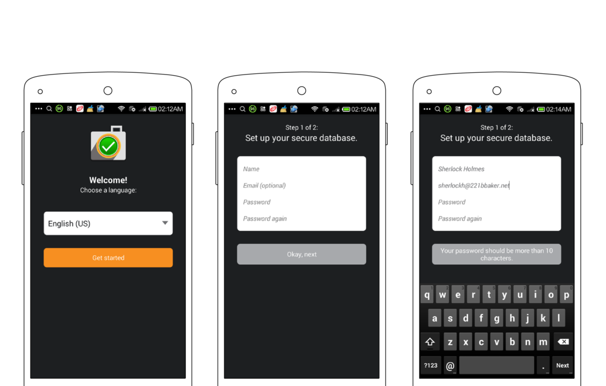
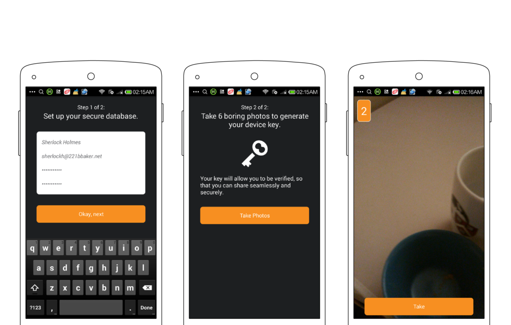
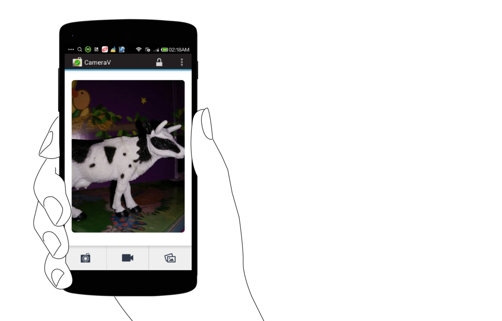
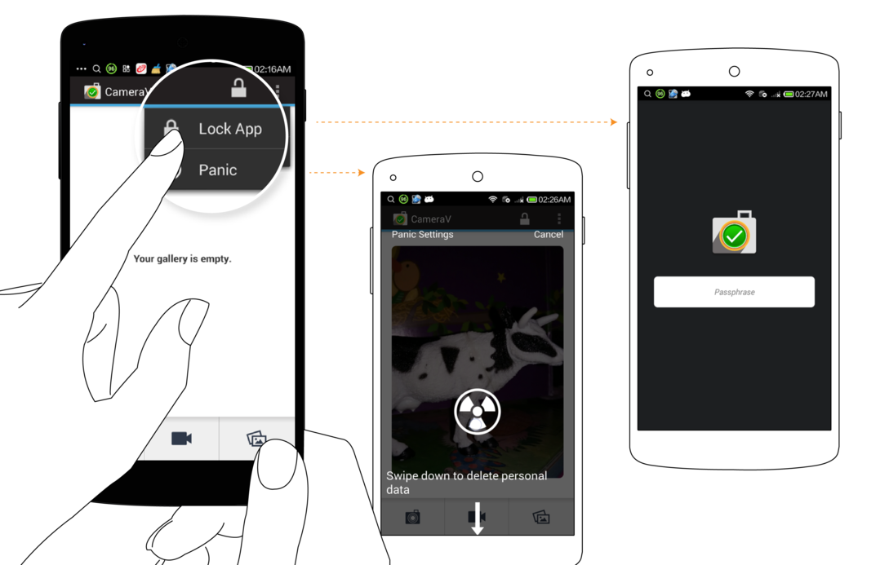
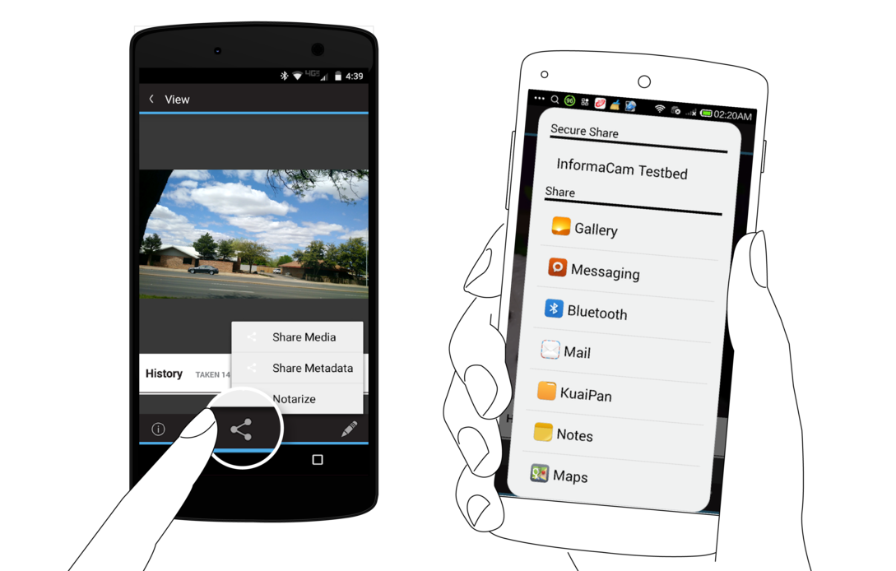
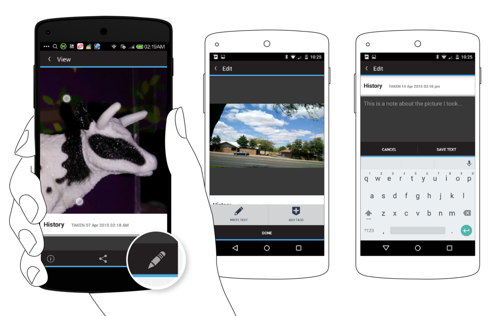
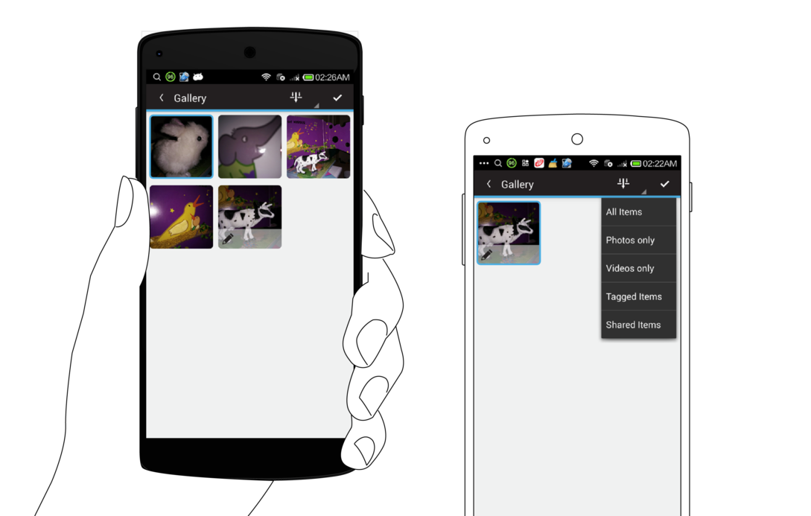
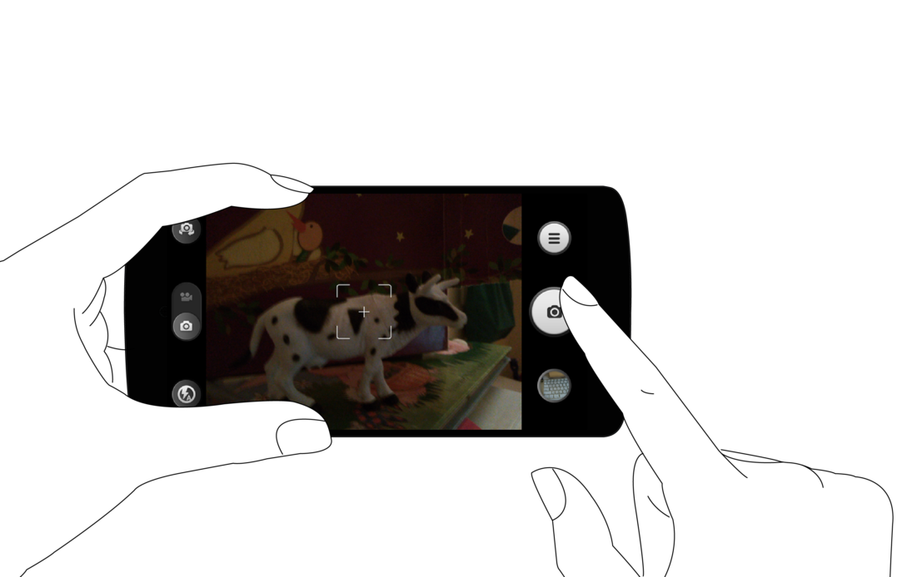
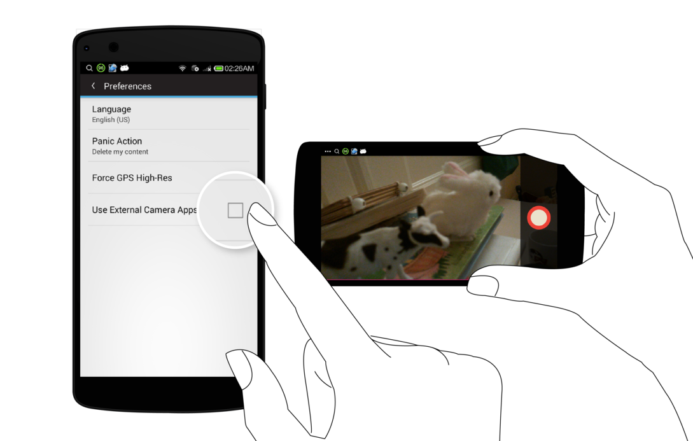
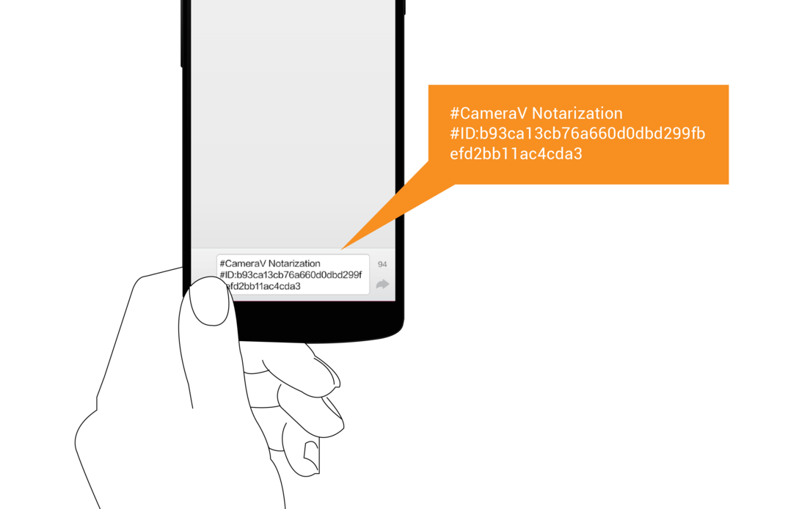

# CameraV app and the InformaCam System 

]

## TRUST (BUT VERIFY!) WHAT YOUR EYES SEE

InformaCam is a system that uses the built-in sensors in modern smartphones for tracking movement, light and other environmental inputs, along with Wi-Fi, Bluetooth, and cellular network information to capture a snapshot of the environment around you, while you are taking a photo or video. This extra metadata (the data about the data!) helps verify and validate the date, time and location of capture, and provides an entirely new layer of context and meaning out of "invisible" energy for use in any way you choose. Finally digital signatures and encryption ensure that your media hasn't been tampered with since capture and that it can only be seen by the people you choose.

Currently, you can use InformaCam by installing the CameraV app for Android smartphones. CameraV uses V for Verification, Veritas (Truth!) and Vaulted (secured!). It is also evokes the "V" hand sign for victory and peace. 

## Easy To Use

CameraV is the easiest way to capture and share secure photos and videos on a smartphone or tablet.

## Sensor Smart

CameraV turns sensor inputs like compass, light, temperature, location and more into "metadata for good".

## Share Media and Metadata

Upload and share media captured from CameraV wherever you choose, and people can trust what their eyes see.

## Crypto-Power

CameraV has strong encryption and network security built-in using technology OpenPGP, IOCipher and Tor.

## Open and Free

CameraV, and the InformaCam system, is open-source and freely licensed for use by any individual or organization.
# Chapter 1: Quick Start Guide

## Getting Started with Secure & Verified Mobile Media

This document will go into greater detail about the entire InformaCam concept later, but for now we wanted to get your started with some simple useful capabilities. Using Google Play or FDroid.org, you will need to install the CameraV app on your Android phone, running Android OS version 4.0 or higher.

## 3 Things You Can Quickly Do With CameraV

1) Take pictures or video with synchronized sensor metadata capture for later use in verification, analysis, proof or other “blackbox” purposes.

2) Notarize captured photos and videos by sharing the unique ID and sensor metadata through email, SMS or social media.

3) Share photos and videos privately or publicly with the sensor metadata embedded in the media, for later verification and use.

## Taking a Photo or Video With Sensor Metadata

The CameraV sensors automatically activate when you start capture. You can optionally enable Location, Bluetooth and Wifi services in your Android Settings to allow the app to use those sensors.

### Enable Sensors

- You control if Wi-fi, Bluetooth, GPS are used
- For Location, you can control the type of location service
- To disable mobile network sensors, put phone into airplane or "flight" mode

### Viewing Photos and Video in the Gallery

Gallery button opens multiple thumbnail screen. Tap on thumbnail to open detailed view.

Check mark icon for multiple selection and deletion.

## Notarizing Captured Photos and Video

You can generate a unique visual fingerprint identifer, basically a unique code, for each media file captured. Then you can share this code a short message that you share through SMS, email or more publicly on social media.

## Sharing Photos, Videos and Sensor Metadata 

## Sharing Options

SHARE options:
Share Media
Share Metadata
Notarize

Share Metadata metadata only shared as JSON plaintext
Notarize: unique ID for media and link to media page on secure test bed

# Chapter 2: Is This For Real?

## Is This For Real? How InformaCam Improves Verification of Mobile Media Files

There is currently a deluge of media coming from the world’s mobile devices for potential use as evidence or trusted sources for journalists.  WITNESS and the Guardian Project are working to provide a mechanism, InformaCam, to verify and authenticate this footage.

Late last year, antivirus software pioneer, John Mcafee was arrested in Guatemala having fled his home in Belize where he was wanted for questioning related to the murder of his next door neighbor.  McAfee’s location was inadvertently disclosed through the embedded metadata in the iPhone photo published by the journalists interviewing him.

Pictures taken with mobile phones often contain embedded information, known as metadata, which can record information including: the type of camera that took the picture and the date and time.  They can also contain location information like GPS coordinates which can be used to determine where an image or video was captured. Sometimes metadata can expose information that the user doesn’t want shared.

We’ve been training human rights defenders about the security risks posed by metadata in digital files for a while. Capturing video with sensitive information can put people in harm’s way. In response, we developed with our partners at the Guardian Project,  ObscuraCam, a mobile phone app that as well as stripping out metadata automatically detects and blurs out faces in videos and images. About six months ago, YouTube introduced a similar blurring feature on their website.

Facebook user Gregory Michael shared this false photo supposedly showing a shark in post-superstorm Sandy waters in New Jersey, USA
However, there are times when citizen journalists and human rights defenders might need to preserve more information rather than less, to ensure their digital files can be accessed later for legal evidence or for archival purposes. Or they may want to have the geolocation metadata, additional detailed information about what they are capturing, and the ability to encrypt it, in an effort to help media outlets trust and verify the content. In an age where digital manipulation of images and video is commonplace, news agencies have to contend with the possibility that digitally altered media is being passed off as unadulterated truth.

Syria is one such example where mobile video has been used extensively to document potential war crimes as well as to serve as possible propaganda. More mundane scenarios exist in every situations from the incredible photo of a tornado in Alabama to the notorious claims of sharks swimming in flood waters after Hurricane Sandy hit the U.S.’ northeast coast.

To address those needs we’ve been working on InformaCam, a mobile app that allows Android devices to take images and videos, embed them with geotemporal and other metadata, sign them with a digital signature unique to the device’s camera censor, encrypt and then send those files to someone they trust who maintains a secure server. Among other elements, the process preserves the chain of custody of the media, making it more likely to be admissible in a court of law.

Since we first announced the project, we’ve been working on refining the functionality of the app and building the prototype of a secure server which stores and verifies the chain of custody of the media. Together WITNESS, The Guardian Project and our partners at the International Bar Association, hope to have a pilot secure repository ready for testing the next few months. Eventually the plan is to create an installer that will allow anyone to quickly and easily set up their own secure repositories.

When a user runs InformaCam for the first time, a setup wizard goes through the steps to create a password for the application and how to generate an encryption key based on the unique properties of the camera sensor.  Since every camera has a unique pattern of sensor noise, it’s possible to create a “fingerprint” of the device’s camera.  This key will be used to verify that any piece of media captured using the app and uploaded to the secure server came from this specific camera.

Once the setup is complete, the user has a choice of taking a picture or shooting a video. During the shooting process, InformCam continuously accesses the various sensors in the mobile device. These sensors include:

* Motion, such as accelerometers which record any movement occurring during the recording process – this will help to determine if the person was in a vehicle while recording for example.
* Position, such as GPS which will provide fairly exact coordinates where the image or video was taken – this data can later be plotted on a map
* Environmental, such as thermometers which can be later referenced against recorded temperature or other climatic data

This sensor data creates a digital snapshot of the environment in which the media was captured and allows for later analysis to confirm that not only was the media captured by a specific device in a specific date, time, and place, but also enables the cross checking of this information against weather conditions at the time. It will also record what wifi networks and bluetooth devices were in the vicinity so that these can be used for corroboration, and (in the case of mobile phones) which cell towers the device was communicating with.

This enhanced metadata is bundled within the mediafile and both, encrypted and hashed, creating a small piece of text that acts as a “digital signature.”  Since this digital signature is so short, it can quickly be sent via email or sms text to a secure server or other 3rd party and used to verify that neither the media nor the metadata was altered in any way since the time of capture. This can be very useful in cases where the user has limited access to a high speed data connection.

For example, if a user recording footage in a rural area of Kenya in which there is a limited GSM coverage but no data service, InformaCam can send the hash of the media file via SMS to the secure server. A week later when the user gets back to her office with a high speed data connection, InformaCam will complete the upload process and the incoming media file can be checked against the hash received from the field.

The Future of Mobile Media as Evidence

We’re often asked what the best camera is to use for human rights video and as most photographers know, the best camera is the one you have have with you when you need to take a picture. Whether it’s taking a photo of a fender bender to submit to your insurance company or documenting war crimes in Syria the majority of images and videos taken by ordinary people are done so using mobile phones.

The ability to automatically verify these videos and images is important to human rights defenders, a journalist, or a regular person. These phones more often than not, contain additional information that could compromise the person taking the image or video, but this same data can also provide valuable evidence that could help verify that something happened at a particular time and place. InformCam uses the built in features of mobile phones to collect this data, protect it, and provide a mechanism by which to verify that it wasn’t tampered with. This preserves the chain of custody, adding to the evidentiary value of the images and videos captured.

Our hope is that InformaCam as well as it’s features, such as J3M, are adopted by users and developers of technology. We want commercial providers to incorporate these “witnessing” functionalities into their own products and platforms – such as a “witness” mode on your camera or an opt-in choice when you upload or share a video on YouTube, Twitter or Facebook. In the future we’d like to see the capacity to be a “citizen witness” enhanced for any person around the world documenting a news event or a human rights violation.

# Chapter 3: About Sensors and Metadata

This covers the sensors that InformaCam taps into on the phone and the J3M format (JSON Mobile Media Metadata) we use to store the data.

## Sample J3M File

Below is annotated version of the JSON data in a typical J3M bundle.

The "asset_path" represents where the file was original stored on the InformaCam app's encrypted internal storage. This will be rarely used, but could be helpful in extreme situations where inspection of the capture device is necessary:
> {"asset_path": "submissions/45454ac1ade36ebec3749e8dc2aedc4b", 

The Genealogy tag provides the basic data about the source of the media. "hashes" is an MD5 hash of all the pixel values of the image or video frames. "createdOnDevice" is the OpenPGP public key fingerprint for the user/app. "dateCreated" is a timestamp value for when the media capture occured.

>"genealogy": {"localMediaPath": "/e61756a62a37535b77b0183318c79d26a2e0bdf0", "hashes": ["9230de4b067b2f14afcaa41d23b30a09"], "j3m_version": "J3M version 1.0", "createdOnDevice": >"694db2c3ecc07ac07f63e323f7b9a0cefada94cf", "dateCreated": 1386690725995}, 

file_name is the name of the J3M file as stored in the phone's internal memory
>"file_name": "kxerFDrNCHiNOxawWUgYEbknbC.j3m", 

public_hash is a SHA-1 cryptographic hash that combines the user's public key fingerprint and the MD5 media hash from above. This is used as the searchable public token identifier for the media file
>"public_hash": "b840cbfd806865fff8cc34078540224cfe804ae5",

Intent represents the alias of the person who captured it, again their pgp key fingerprint, and who they meant to send this media file to, along with any record of it actually being transmitted. The "intendedDestination" information comes from any installed "trusted destination" or ICTD configuration files, that are stored in the app
> "intent": {"alias": "ai whiteness", "ownershipType": 400, "pgpKeyFingerprint": "694db2c3ecc07ac07f63e323f7b9a0cefada94cf", "intendedDestination": "InformaCam Testbed"},
> "date_admitted": 1386726920279.5662, "_id": "86ae352e68328c06de7840f4cb6be809",

The "data" section is where the sensor metadata logs are stored. It is an array of timestamped sensorCapture items
> "data": {
>"sensorCapture": [

This is an orientation event, containing azimuth, pitch and roll, both in raw formats and "corrected" based on the orientation the user is holding their phone
>{"timestamp": 1386690720753, "captureType": 271, "sensorPlayback": {"azimuthCorrected": -1.84727144241333, "pitchCorrected": 0.017154498025774956, "azimuth": 43.07861328125, "pitch": >-18.8385009765625, "roll": -132.7789306640625, "rollCorrected": -0.12050031125545502}}, 

This is a light meter value
>{"timestamp": 1386690734267, "captureType": 271, "sensorPlayback": {"lightMeterValue": 13}}, 

This is a combined event with light meter and pressure data, both raw, and adjusted based on the phone's indicated local elevation
>{"timestamp": 1386690729261, "captureType": 271, "sensorPlayback": {"pressureHPAOrMBAR": 1007.3463134765625, "lightMeterValue": 10, "pressureAltitude": 49.26783752441406}},

This is "visibleWifiNetworks" event capture displaying network names, frequency, strength and MAC address information
>{"timestamp": 1386690729939, "captureType": 271, "sensorPlayback": {"visibleWifiNetworks": [{"bssid": "28:c6:8e:ba:ea:dc", "wifiFreq": 5220, "wifiLevel": -93, "bt_hash": >"afbf1e7ffc07f6b4471e34f8470f5fde947a8f2b", "ssid": "cloudcity5ghz"}, {"bssid": "1c:af:f7:d8:db:61", "wifiFreq": 2462, "wifiLevel": -88, "bt_hash": >"9c1cb7186bea393589ac3a591052f91da423205e", "ssid": "Cloud10"}, {"bssid": "28:c6:8e:ba:ea:da", "wifiFreq": 2437, "wifiLevel": -61, "bt_hash": "7b3b34fe541048f0e0800f1b788dc44cfdf6a59d", >"ssid": "cloudcity"},... 

This is a GPS location event, display latitude, longitude and current accuracy of the sensor, based on whether it is coming from satellite, wifi, cell towers, etc.
> {"timestamp": 1386690719706, "captureType": 271, "sensorPlayback": {"gps_coords": [-71.1253508, 42.3286856], "gps_accuracy": "32.119"}}, 

This is an accelerometer event, showing X,Y,Z motion data
>{"timestamp": 1386690721758, "captureType": 271, "sensorPlayback": {"acc_z": 9.188077926635742, "acc_y": 2.7202823162078857, "acc_x": -1.9511220455169678}},

This is a telephony event, showing both any bluetooth devices noticed in the area, and information about the cellular network tower the smartphone is currently registered with. If the device is a wifi only device, or is not using a SIM card, this data will simply be omitted. The bluetooth device address does NOT display the name of the actual device MAC address, but instead shows a one-way hash value. This was an attempt to preserve some privacy for individuals who might be in the area.
>{"timestamp": 1386690719714, "captureType": 271, "sensorPlayback": {"bluetoothDeviceAddress": "5d9d203488950ff20c07b6dbfe9a8b8ddabafc6c", "LAC": "36493", "MCC": "310260", >"bluetoothDeviceName": "Nexus 4", "cellTowerId": "79211356"}}, 

After the sensor data, the J3M then shows basic "EXIF" style information from the capture device:
> "exif": {"orientation": 0, "focalLength": -1, "timestamp": "2013:12:10 10:51:48", "make": "LGE", "flash": -1, "height": 960, "width": 1280, "iso": "100", "location": [-71.1250228881836, >42.32872772216797], "duration": 0, "model": "Nexus 4", "exposure": "0.033", "whiteBalance": -1, "aperture": "2.7"}, 

Finally, any user annotations, based on Open Data Kit forms provided as part of the "Trusted Destination" file, are shown here:

The form definition used is indicated, and a basic free text annotation is shown here:
>"userAppendedData": [{"associatedForms": [{"path": "/forms/493dde68c49e6b99556186a3e776d705.xml", "namespace": "iWitness Free Text Annotations", "id": "234d025ee64976d27e1d2305f80824bc", >"answerData": {"iW_free_text": "watch out for icy sidewalks and roads"}}], "timestamp": 1386690794797, "id": "cdb7c22265121160dec5c0598263f58c"}, {"associatedForms": [{"path": >"/forms/493dde68c49e6b99556186a3e776d705.xml", "namespace": "iWitness Free Text Annotations", "id": "b63a2a65fc91dd9744d6cd5cea5cb28d", "answerData": {"iW_free_text": "this tree might >fall down"}}, 

If an annotation is placed at specific X,Y point in the image, or X,Y+time window for video, that information is also provided:
>{"path": "/forms/46b9f8e70113ae0f39ae26338c0dc433.xml", "namespace": "iWitness v 1.0", "id": "fae0900eec13baefce4f98b895b80405", 
>"answerData": {"iW_individual_identifiers": "Victim"}}], "timestamp": 1386690798758, "regionBounds": {"top": 224, "displayLeft": 415, "height": 118, "width": -37, "displayWidth": 115, >"startTime": -1, "displayTop": 224, "displayHeight": 118, "endTime": -1, "left": 263}, "id": "1e9d35bed92b8fdfe46b251afb3227f2", "index": 0}, {"associatedForms": [{"path": >"/forms/493dde68c49e6b99556186a3e776d705.xml", "namespace": "iWitness Free Text Annotations", "id": "b63a2a65fc91dd9744d6cd5cea5cb28d", "answerData": {"iW_free_text": "this tree might >fall down"}}, {"path": "/forms/46b9f8e70113ae0f39ae26338c0dc433.xml", "namespace": "iWitness v 1.0", "id": "fae0900eec13baefce4f98b895b80405", "answerData": {"iW_individual_identifiers": >"Victim"}}], "timestamp": 1386690798758, "regionBounds": {"top": 224, "displayLeft": 415, "height": 118, "width": -37, "displayWidth": 115, "startTime": -1, "displayTop": 224, >"displayHeight": 118, "endTime": -1, "left": 263}, "id": "1e9d35bed92b8fdfe46b251afb3227f2", "index": 0}]}}

### Impossible Values

To easily translate values from JSON into our database, certain values must not be null, or NaN, but must be given impossible values that still adhere to the expected type.  The following notes apply to specific values:

* Cell Tower ID, if unknown, will be recorded as -1.
* Location data, if unknown, will be recorded as [0.0, 0.0].  This is technically a legitimate latitude and longitude, but should be regarded as NaN.  Do note that the Android client always reports position with up to 9-decimal place precision; should a client actually report from this location, the actual reading would be similar to 0.000000134.

# Chapter 4: More Details on Sensor Metadata and Inputs

The metadata captured by the CameraV app comes from different chips and sensor components in the smartphones. The table below details how the different pieces of data are generated, and where they come from.

|J3M TAG|SOURCE: Sensors / Component / Radio / Other|DESCRIPTION|
|-----------:|---------------------------------:|-----------------------|
|timestamp|	System clock + NMEA data from GPS|	UNIX timestamp of when data from sensor is read|
|pressureAltitude||	Calculated from the "pressureHPAOrMBAR" value & sea level value	meters from the atmospheric pressure and the pressure at sea level|
|pressureHPAOrMBAR|	Barometer / Pressure sensor|Measures the ambient air (atmospheric) pressure in hPa or mbar.|
|lightMeterValue|	Ambient Light & Proximity sensor|	Ambient light level in SI lux units|
|bearingDegrees|	Accelerometer + Compass/Magnetometer|	the accelerometer is used to figure out how you are holding your phone so that the magno readings can be adjusted properly|
|acc_z, acc_y, acc_x|	Accelerometer|This is an accelerometer event, showing X,Y,Z motion data|
|pitch, roll, azimuth|	Gyroscope sensor|This is an orientation event, containing azimuth, pitch and roll, in raw format based on the orientation the user is holding their phone|
|pitchCorrected, rollCorrected, azimuthCorrected||	interpreted data from pitch, roll, azimuth|
|temperature|Temperature sensor|Ambient temperature in Celsius (only some phones have this sensor)|
|gps_coords, gps_accuracy, gps_bearing, gps_altitude, gps_speed, nmeatime, nmeamessage |GPS|GPS location event - latitude, longitude and current accuracy of the sensor, based on whether it is coming from satellite, wifi, cell towers. GPS data is being continously collected and timestamped (vs. EXIF contains only one instance of gps data).|
|visibleWifiNetworks| "bssid, ssid, wifiLevel, wifiFreq"|	WiFi radio API	"BSSID and SSIDs broadcast by other wifi routers.  ""bssid"" (MAC address), ”ssid"" (name of wifi), ”wifiLevel"" (Signal strength), ”wifiFreq"" (Frequency)"|
|cellTowerId|	SIM card	|ID of cellular network tower the phone is currently registered with.| 
|MCC|	SIM card|	Mobile Country Code - identifies the country of origin of the SIM card|
|LAC|	SIM card|	Location Area Code|
|"bluetoothDeviceAddress" "bluetoothDeviceName":|	Bluetooth radio API|	MAC Addresses of bluetooth devices noticed in the area. The bluetooth device address does NOT display the name of the actual device MAC address, but instead shows a one-way hash value. This was an attempt to preserve some privacy for individuals who might be in the area.|
|exif|	Jpeg EXIF Header Data|	Basic EXIF metadata from the capture device: "exposure", "orientation","flash", "iso", "aperture" "duration","height", "width", "location","whiteBalance","focalLength", "make", "model", "timestamp".|
|userAppendedData|	|User annotations, based on Open Data Kit forms	Descriptive metadata entered by the user.|
|"intakeData":{"data" (???)|	App	|???|
|"intakeData":{ … "signature"|	App	|the PGP signature of all the sensor data|
|"ownershipType"	|App|	???|
|“alias":	|App|	(Name/ nickname provided on setting up the app)|
|"pgpKeyFingerprint"|	App| 	OpenPGP public key fingerprint for the user/app (Fingerprint of device + app instance)|
|genealogy: (“localMediaPath”)|	App|	Represents where the file was originally stored|
|"dateCreated"|	System clock and NMEA data from GPS|	UNIX timestamp value for when the media capture occured.|
|"hashes"|	SHA-1 (pic) / MD5 (video)|	checksum of all the pixel values of the image or video frames "j3m_version"	App	Version|
|"createdOnDevice"|	App|	OpenPGP public key fingerprint for the user/app (Fingerprint of device + app instance)|
|"signature"|	|	PGP signature for the entire J3M content|
# Chapter 5: Taking Photos and Videos Securely and Safely

This chapter will walk you through using the built-in camera and video (camcorder) features of the mobile app.

## Installation 

Before you can use the CameraV app, you must install it. You can find download links for the application at the following web URL: https://guardianproject.info/informa or search Google Play for "CameraV". If you install the app from outside of Google Play, via a direct APK file download, you will need to enable the  "(Allow) Unknown Sources" option, in your Android Settings->Security->Device Administrator section. Once you have installed the app, you can disable the "Unknown Sources" option.

## First-Time Setup

The first-time you use CameraV, you must configure it with basic identity information. The app asks for an identifying name of some sort, which can be your real name or a pseudonum. You can also optionally include an email address, which again, may be your standard email, or a special one you setup just for use with this app. By providing an email address, you ensure that someone who may later find a photo or video captured and shared with CameraV, can contact you.

You must also enter and confirm a password to use with CameraV. This is a new password that is used to protect the photos, video, and sensor metadata stored within the app itself. It is, in a sense, the secret combination for the vault of data the app is protecting.

Finally, you must take six sample photos with the CameraV app during the setup process. This generates a visual fingerprint of your camera sensor, that can be used later to prove that a specific image or video did or did not come from your camera. The app will ask you to take a "boring" photo, which means a blank wall, table or some other uncomplicated surface. The need for "boring" is a technical detail related to the visual fingerprint process.

Once you complete all of these steps, the setup process is complete, and you will be taken to the CameraV app homescreen.

## Three Essential Views

The CameraV app is compromised of three essential views:

* First is the Home view, which allows you to quickly swipe from left-to-right through the latest captured media. The first-time you run the app, this screen will be empty.
* Second is the Media view. If you tap any image or video preview or thumbnail, you will be taken into a detailed media via that allows you to see the full photo or video, and pinch and zoom the image, or playback and scrub the video. You can also perform operations like share on this screen through menu actionbar commands.
* Third is the Gallery view, which provides thubmnail overview of all captured media, and the ability to filter and sort that media. You can also perform batch share and delete actions through this view.

### The Home View

The Home view is what you are presented with when you enter the app for the first time. It allows you to quickly see the last few media items captured, and swipe through all of them. You can tap on any media preview image to switch to the Media view, which will show the full photo or video.

From this view, is also where you open the camera or navigate to the Gallery view. The three buttons at the bottom of the screen represent Still Camera, Video Camera and Gallery, in that order. The camera buttons open up the camera for capturing media in the indicated formats. The Gallery button opens up the Gallery view for filtering and batch processing of media.

You can also lock the app from the menu option, to sign out, and remove all cached information from memory. The app will then require you to enter a password the next time you open it. Finally, there is also the "Panic Button" action available on this screen, from which you can quickly erase all media and app data from CameraV. We will talk more about all the security capabilities in another chapter.

### The Media View

The Media View, or Detailed View, presents a captured photo or video in it's entirety. You can see the entire photo captured, and pinch and zoom it to get a closer look. You can also rotate your phone into landscape mode, if it is a landscape image. You can watch a video in this view, as well. It may take a few seconds to load, but then you can press play to view the video. You can also drag the playback cursor to scrub, or move frame by frame, through the video.

At the bottom of the view, you will see a "History" section. This is where all actions on the stored media is recorded. This includes when you captured the media file, when you have exported and shared it, and so forth.

At the top of the Media view, you will see three action icons: the Informa View "I", the Share action, and the Edit "Pencil" action.

The Informa View provides full access to the raw sensor metadata captured when you took the picture or recorded the video. It is shown in the "J3M" format you can learn about elsewhere in this guide.

Tapping on the Share action will reveal three more options: Share Media, Share Metadata and Notarize. 'Share Media' will package up the media file with the metadata, and generate a new JPEG or MPEG-4 file that can be shared with any app, to send via email, post on social media, or upload to a website. 'Share Metadata' will just share the sensor metadata as a plaintext file in the J3M format.

'Notarize' will share a short snippet of text containing the media file's unique visual fingerprint identifier, that can be easily shared via SMS, email, Twitter or some other short message channel. This provides a way to timestamp the media with a third-party, and ensure that any tampering or modification of the media can be later detected.

Tapping on the 'Edit' action will allow you 'Write Text' in order to provide a basic description of what the capture media item is about, or some other context you wish to provide. 'Add Tags' will allow you to place a tag box on the media at a certain place, or time in the case of video. You can then tap on that tag box to enter more detailed information about what it is you were tagging, and why.

You can return to the Home View by pressing the top-left hand back arrow, or by pressing the back key on your device.

### The Gallery

The Gallery view provides a thumbnail view of many media items at once. You can filter media items by type, to see only photos, only videos, or all. You can also select multiple media items for batch operations, by using the checkmark action, or pressing on one item and holding for a few seconds. This will engage the multi-select mode, which allows for multiple items to be selected at once. You can then do a batch export and share action, or delete action. The Share options provided are the same as in the Media view: Share Media, Share Metadata, and Notarize.

## Using the Cameras

From the Home view, you can launch either the Still Camera or the Video Camera. By default, the app will launch the built-in external camera apps that are available on your phone. It will monitor these external camera apps, and when new photos or videos are captured, it will inspect them, extract their metadata, and store a thumnail and the data in the internal encrypted storage. While they will show up in the Gallery view, the actual media file are stored unencrypted in the standard device media storage location on the external memory or SD Card.

To use the encrypted camera capabilities of CameraV, you must go into the CameraV Settings, and uncheck the "Use External Camera Apps" option. Then, the camera action buttons on the Home view will launch the built-in encrypted camera feature. This provides a basic still and video camera capability, with the outputed photo or video file written directly to encrypted storage. This means that only CameraV can see the media, and that if you delete a file it is completely deleted from the device, and not recoverable.

The encrypted camera have only a simple button to take a picture or to stop and start video recording. All other settings are automatic.

When you are done capturing media, you can use the back key to return to the Home view or the Gallery view to see the captured media files.

# Chapter 6: Sharing and Using Metadata

This chapter will show you how to share the sensor and verification metadata associated with every photo and video you've captured using the app.

## How to Share Metadata

From the Media view, you can select the 'Share' action, and then the 'Share Metadata' from the second menu. This will generate a plain text document (more on this below), that you can share with any app on your device that will accept that kind of content.

You can also 'Share Metadata' from the Gallery view, and share multiple metadata documents in batch, using the multi-select capability.

## What is the Metadata?

The metadata you can share from CameraV is the collection of sensor and network event data captured around the time that the photo or video was captured. It is organized and store using the Javascript Object Notation (JSON) format, and more specifically, as JSON Mobile Media Metadata, or J3M (pronounced as in "Gem"). The J3M file is a plain text, human readable format, that are various groups of name=value pairs, grouped in brackets like {name: value}, or {name { name0: value0, name1: value1}, and so on.

## Why would I want to share it?

Sharing the metadata allows you to share all the information about your media, without sharing the media file itself. This might make sense if your bandwidth is low, or if you only want to share the where, when and what you have captured, and not the visuals. The metadata also includes cryptographic signatures of the data and the media file itself, which provides proof of authenticity. If the receipient of your metadata later receives the media itself, they can compare the media to the unique signatures provided in the metadata to ensure the file was not tampered in the interim time.

# Chapter 7: Notarizing Your Photos and Videos

This chapter will show you how to notarize the photos and videos captured through the app, to prove that they exist and belong to you!

## What is Notarization?

Traditionally, the process of having a notary sign a document, proves that that you are who you say you are, or that some document has been verified by a trusted authority. In the case of InformaCam and the CameraV app, the notarize process is key to using media as proof of something. 

Notarization is also very useful, because it only requires you to share a very small, short message, that can easily be sent via something like an SMS text message. It does not require a full Internet connection on your device to share a notarization.

## What happens when I notarize media?

When you choose the 'Notarize' option, a short message is generated that includes the unique identifier, or "fingerprint", of the media file. This message can then be shared with any of the apps on your device that allow you to share messages, like SMS, email, Twitter, Facebook or other apps of that sort.

## Public versus Private Notarization

You can choose to publish the notarization message publicly, which then would create a public timestamp that this media existed in this specific state, for all to see.

You can also choose to share the notarization message privately, which then can be used by the recipient to compare to the media or metadata when they receive the file at a later date.

# Chapter 8: Using "Proof Mode" with Any Camera App

This chapter shows you how to active the app's "Proof Mode" feature in order to capture content from any camera app that stores photos and video in the public external storage.

## What is "Proof Mode"?

One way to use the CameraV app is for a specific purpose, for documenting a specific incident, item or recording a specific testimonial. In that case, you know to select the CameraV app, open it, choose the camera you want to use, and then capture the media. However, in some cases, you may not be sure when you want to use it, but you do want to ensure that you have the benefit of the sensor metadata, the signing metadata, and more, when you need it. You may also want to take many pictures and videos, say at a protest march or over the course of many hours, and not have to think about which camera app you are using. It is in cases like this, where "Proof Mode" come to play.

## How to Activate

"Proof Mode" is the background, always-on way to run CameraV and the InformaCam system on your device. When you unlock the CameraV app, on the Home view, you can open the menu through the three dots action, or a menu key on your device, and you will see the "Proof Mode" option. Selecting this will activate the always-on background service, and will show a persistent notification to indicate this.

At this point, you can switch away from the CameraV app, and return to the Android launcher screen. From here, if you select any camera or media capture app that creates new photos or videos in the expected, standard locations, CameraV will detect this. The new media will be imported into the CameraV database and attached to the sensor metadata, just as if you had taken the photo or video from within the CameraV app.

## How to Deactivate

To deactivate "Proof Mode" and return to the standard use of CameraV, open the notification area of Android, and select the Proof Mode persistent notification display there. This will bring up the CameraV Proof Mode view, from which you can press the button to deactivate the feature.

## Managing Imported Data

In the Gallery view, you should see all the photos and videos that were captured while Proof Mode was activated. You can use the multi-select mode to delete any that you do not want to keep, or use it to batch export media or metadata of the many files captured. You can also use the Media view to review specific photos and videos. 
# Chapter 9: Scenarios of Use

This chapter will talk through a few different plausible scenarios where this app could be used, and the right steps to make that happen successfully.

## To Capture Photographic Evidence of an Incident

The InformaCam system, and specifically the CameraV app, is well suited for capturing photographic evidence of an incident of any nature. This could range from the aftermath of a car accident, to the damage of property during a natural disaster. It could also be used to document violence between citizens, or between police or military forces and citizens. 

The goal in any of these cases is to capture the state of some thing, at a specific point of time, and then share that media evidence with an authority that can use it for the application of justice or monetary compensation. In this case, the encrypted storage and verification features help prove that the evidence was not tampered with, and was captured at the time and place that matches the crime.

A secondary goal could be for advocacy and awareness. Using CameraV in this cases helps bolster your case, to provide proof to your broader public audience that what they are seeing is true, authentic and unmodified.

## To Record a Video Eyewitness Testimonial

In many war crimes events, evidence is gathered after the fact through testimonial interviews with victims, witneesses, or others with knowledge of the incident. It is of prime importance that these interviews are protected, only accessible to those who need access.

## To Document a Protest March and Public Gathering  

It is a common sight to see hundreds of phones emerging out of the crowd, documenting whatever they can see, during any large public gathering.

## To Add a "Data Journalism" Layer To Your Story

The sensor metadata captured by CameraV provides a fascinating additional layer of real-world data and context that is normally invisible to the naked eye.
# Chapter 10: Threats and Risks

All the things you should think about that could go wrong.

# Chapter 11: Security Features

This chapter will give you an overview of all the security features of CameraV and the InformaCam system in one place.

## Storage Encryption

CameraV contains a fully encrypted storage capability, that appears as a single file on the device storage. It uses the IOCipher virtual file system for this, and enables metadata and metadata to be direclty stored in encrypted format, without ever being stored in the clear on the device. This is important, since once you store something unencrypted on a mobile device, you open it up to being copied or intercepted by other apps, or being forensically recovered at a future time. 

Photos and videos are only encrypted if you use CameraV's built-in encrypted camera capability, and not external camera apps. Import of unencrypted media into the encrypted storage is not currently supported or ideal.

## App Locking via Passphrase

As part of the encrypted storage, the app supports locking access to itself and data behind a passphrase. When you first open the app after a device start, you will be required to enter the passphrase you chose on setup. The app should then remain unlocked until you manually lock the app, or restart your device.

## Media and Metadata Signing via PGP

CameraV includes built-in OpenPGP (Pretty Good Privacy) capabilities for signing and encryption of data. All metadata is signed by the private key of the user that is generated during the app setup. This signature data is included in the J3M document when you export it. 

It is also possible for entire metadata documents to be encrypted for sharing to a remote recipient, but this requires a specific "trusted profile" to be configured and setup.

## Media Hash Generation

SHA-1 hashes are generated for each media file, and included in the exported J3M documents. This hash is also used as the visual media fingerprint for the notarization process.

# Application Permissions

The CameraV app does require access to a large set of permissions, in order to have access to all of the sensor and device metadata capabilities required. Below is the list of the primary required permissions, and a short explanation about why they are needed.

* Full network access: Allows the app to make network connections of any sort, including access to remote servers
* Approximate and Precise Location: Allows the app to get your location through a variety of means including using the GPS and Network-based location features
* Read Phone Status and Identity: Allows the app to access your device identifier, which helps create the unique identifier associated with your media files. This is part of the proof that it really came from your device. However, this data is never publicly shared, so that your real identity is only shared if you choose to.
* Retrieve Running Apps: Allows to the app to retrieve information about currently and recently running apps. This is used as a countermeasure against third-party apps that may be faking metadata sensor information. 
* Access Bluetooth Settings: This allows to the app to activate and manage your Bluetooth connection. This is used to gather data about Bluetooth devices in your area, and add that into the sensor metadata.
* Connect/Disconnect from the Wireless LAN (WLAN): As it says, this allows the app to manage WiFI and WLAN connections, which like with Bluetooth, is used to gather data about the networks in your immediate vicinity, as part of the sensor metadata. 
* Control vibration: As it says, thought not 100% sure why we need this, to be honest!
* Find Accounts on Device: Allows the app to get the list of accounts known by the phone. This is used by the app if you want to share to Google Drive, so we can see which google accounts are available and active.
* Modify or Delete Contents of the SD Card: This is used to read and write data to SD Card external storage. Only media or files related to CameraV are every accessed or removed.
* Record Audio / Take Pictures and Videos: Self-explanatory... it is a camera app after all!

