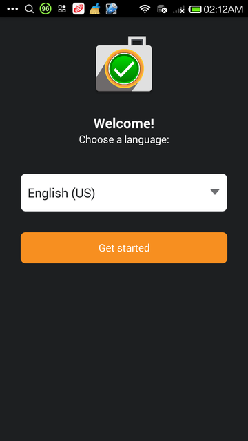
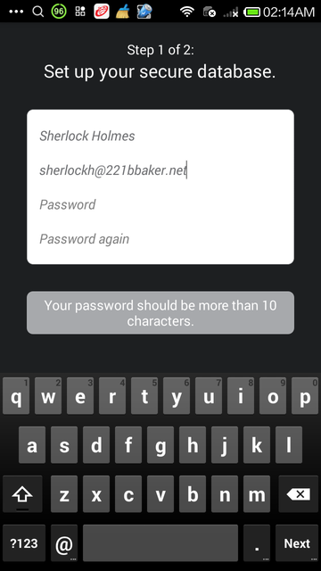
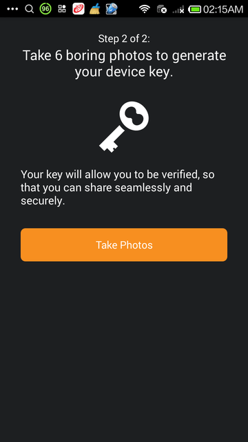
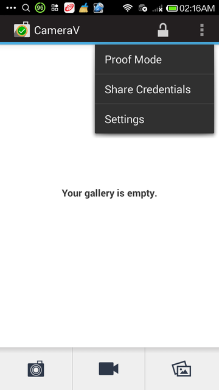
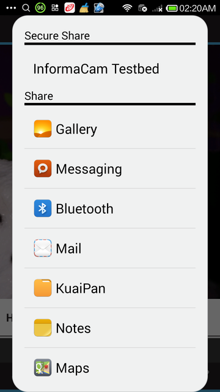
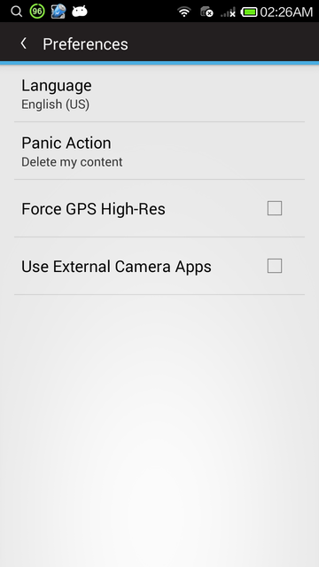
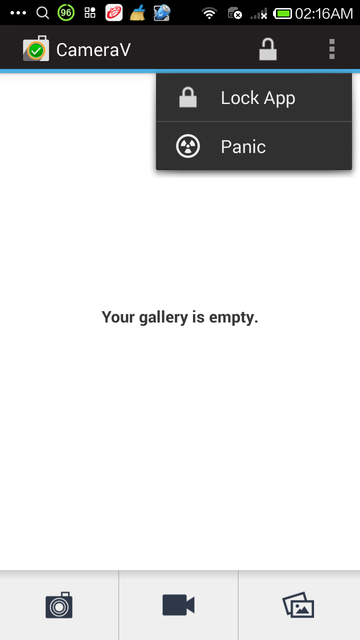

### Guía de usuario del sistema InformaCam y la aplicación CameraV

## CONFÍE (¡PERO VERIFIQUE!) EN LO QUE VEN SUS OJOS

InformaCam es un sistema que utiliza los sensores integrados en los smartphones modernos para monitorizar movimiento, condiciones de luminosidad, y otros datos ambientales, junto con el Wi-Fi, Bluetooth, e información de la red móvil/celular, para capturar una instantánea del entorno a su alrededor, mientras usted está tomando una foto o vídeo. Estos metadatos (¡los datos acerca de los datos!) extra ayudan a verificar y validar la fecha, hora y ubicación de la captura, y proporcionan una capa de contexto y significación enteramente nueva proveniente de una energía "invisible" para que la use de cualquier forma que elija. Finalmente las firmas digitales y el cifrado aseguran que sus audiovisuales no han sido manipulados desde la captura y que sólo pueden ser vistos por las personas que usted elija.

Actualmente, puede usar InformaCam instalando la aplicación CameraV para smartphones Android. En CameraV la V es por Verification (verificación), Veritas (verdad) y Vaulted (asegurado). También evoca el signo manual de la "V" por victoria y paz. 

## Fácil de usar

CameraV es la forma más fácil de capturar y compartir fotos y vídeos seguros en smartphone o tablet.

## Inteligencia del sensor

CameraV convierte las entradas de los sensores como brújula, luz, temperatura, ubicación y demás, en "metadatos permanentes".

## Compartir audiovisuales y metadatos

Suba y comparta audiovisuales capturados con CameraV en cualquier lugar que elija, y la gente podrá confiar en lo que ven su ojos.

## Capacidades-de-cifrado

CameraV tiene un cifrado robusto y una seguridad de red integrada que utiliza las tecnologías OpenPGP, IOCipher y Tor.

## Abierto y libre

CameraV y el sistema InformaCam son de código-abierto y tienen licencia libre para su uso por cualquier individuo u organización.# Capítulo 1: Guía de inicio rápido

## Iniciación a los audiovisuales asegurados y verificados con el móvil/celular

Este documento entrará en mayor detalle acerca del concepto de InformaCam al completo más tarde, pero por ahora quisimos iniciarle en algunas habilidades sencillas útiles. Usando Google Play o FDroid.org, tendrá que instalar la aplicación CameraV en su teléfono Android, que deberá correr un SO Android versión 4.0 o superior.

## 3 Cosas que puede hacer rápidamente con CameraV

1) Tomar fotografías o vídeo con captura de metadatos con sensor sincronizado para su uso posterior en verificación, análisis, prueba, u otros propósitos forenses.

2) Certificar fotos y vídeos capturados al compartir la identificación única y los metadatos de los sensores a través de correo electrónico, SMS o medios sociales.

3) Compartir fotos y vídeos de forma privada o pública con los metadatos de sensores incrustados en los audiovisuales, para verificación y uso posterior.

## Tomar una foto o vídeo con metadatos de sensores

Los sensores de CameraV se activan automáticamente cuando inicia la captura. Opcionalmente puede habilitar los servicios de localización, Bluetooth y Wi-Fi en su Configuración de Android para permitir que la aplicación utilice esos sensores.

### Habilitar sensores

- Usted controla si se usan el Wi-Fi, el Bluetooth y el GPS
- Para localización, puede controlar el tipo de servicio de localización
- Para deshabilitar los sensores de red móvil/celular, ponga el teléfono en modo avión o "vuelo"

### Ver fotos y vídeo en la Galeria

El botón de Galería abre una pantalla con múltiples miniaturas. Pulse sobre una miniatura para abrir la vista detallada.

Icono de marca de verificación para selección y borrado múltiple.

## Certificar fotos y vídeos capturados

Puede generar un identificador único de huella de validación visual (visual fingerprint), básicamente un código único para cada fichero audiovisual capturado. Luego puede compartir este código como un mensaje corto que puede compartir a través de SMS, correo electrónico, o más públicamente en medios sociales.

## Compartir fotos, vídeos y metadatos de sensores 

## Opciones de compartición

Opciones de COMPARTICIÓN:
Compartir audiovisuales
Compartir metadatos
Certificar

'Compartir metadatos' sólo comparte los metadatos como texto no cifrado JSON
Certificar: Crea una identificación única para audiovisuales y un enlace a una página con el audiovisual en un alojamiento seguro
# Capítulo 2: ¿Esto es de verdad?

## ¿Esto es de verdad? De como InformaCam mejora la verificación de ficheros audiovisuales de móvil/celular

Actualmente hay un aluvión de audiovisuales provenientes de los dispositivos móviles/celulares de todo el mundo, por su uso potencial como evidencia o fuente de confianza para periodistas. WITNESS y The Guardian Project están trabajando para proporcionar un mecanismo, InformaCam, para verificar y autentificar este metraje.

A finales del pasado año, el pionero del software antivirus, John McAfee, fue arrestado en Guatemala habiendo huído de su casa en Belice donde era requerido para interrogarle en relación al asesinato de su vecino de al lado. La localización de McAfee fue desvelada inadvertidamente a través de los metadatos incrustados en la fotografía del iPhone publicada por los periodistas que le entrevistaron.

Las fotografías tomadas con teléfonos móviles a menudo contienen información incrustada, conocida como metadatos, donde puede haber información registrada, incluyendo: el tipo de cámara que tomó la fotografía, la fecha y la hora. También pueden contener información de localización como coordenadas GPS que se pueden usar para determinar dónde fue capturada una imagen o vídeo. Algunas veces los metadatos pueden exponer información que el usuario no quiere que sea compartida.

Hemos estado instruyendo durante un tiempo a defensores de los derechos humanos acerca de los riesgos para la seguridad que presentan los metadatos en ficheros digitales. Capturar vídeo con información sensible puede poner a la gente en la senda del peligro de su integridad. En respuesta, hemos desarrollado con nuestros socios en The Guardian Project, ObscuraCam, una aplicación de teléfono móvil/celular que además de retirar los metadatos, detecta y difumina caras en vídeos e imágenes. Cerca de seis meses atrás, YouTube introdujo una característica de difuminado similar en su sitio web.

El usuario de Facebook Gregory Michael compartió esta foto falsa mostrando supuestamente un tiburón en las aguas tras la supertormenta Sandy en New Jersey, EEUU
Sin embargo, hay momentos en que los periodistas ciudadanos y los defensores de los derechos humanos podrían necesitar preservar más información que menos, para asegurar que sus ficheros digitales puedan ser accesibles más tarde para evidencia legal o para propósitos documentales. O pueden querer tener los metadatos de geolocalización, información adicional detallada acerca de lo que están capturando, y la capacidad de cifrarlo, en un esfuerzo para ayudar a los distribuidores de audiovisuales a verificar y confiar en el contenido. En una era donde la manipulación digital de imágenes y vídeo es un lugar común, las agencias de noticias tienen que batallar con la posibilidad de que audiovisuales alterados digitalmente estén siendo hechos pasar por verdades no adulteradas.

Siria es uno de esos ejemplos donde el vídeo de móvil/celular ha sido usado profusamente para documentar potenciales crímenes de guerra, así como servir como posible propaganda. Existen escenarios más mundanos en todo tipo de situaciones, desde la increíble foto de un tornado en Alabama a las notorias afirmaciones de la presencia de tiburones nadando en las aguas de inundación después de que el huracán Sandy golpeara la costa noreste de los EEUU.

Para cubrir esas necesidades hemos estado trabajando en InformaCam, una aplicación móvil/celular que permite a los dispositivos Android tomar imágenes y vídeos, incrustar en ellos datos geotemporales y otros metadatos, firmarlos con una firma digital única para el sensor de cámara del dispositivo, cifrarlos, y luego enviar esos ficheros a alguien en quien ellos confíen que mantenga un servidor seguro. Entre otros elementos, el proceso preserva la cadena de custodia de los audiovisuales, haciéndolos más probablemente admisibles en una tribunal de justicia.

Desde que anunciamos el proyecto por primera vez, hemos estado trabajando en refinar el funcionamiento de la aplicación y construir el prototipo de un servidor seguro que almacene y verifique la cadena de custodia de los audiovisuales. Juntos, WITNESS, The Guardian Project, y nuestros socios en la International Bar Association, esperamos tener listo un repositorio seguro piloto para ponerlo a prueba dentro de pocos meses. Con el tiempo el plan es crear un instalador que permitirá a cualquiera instalar sus propios repositorios seguros fácil y rápidamente.

Cuando un usuario ejecuta InformaCam por primera vez, un asistente de instalación transita por los pasos para crear una contraseña para la aplicación y para generar una clave de cifrado basada en las propiedades únicas del sensor de cámara. Como cada cámara tiene un patrón único de ruido del sensor, es posible crear una "huella dactilar" de la cámara del dispositivo. Esta clave se usará para verificar que cualquier pieza audiovisual capturada usando la aplicación y subida al servidor seguro vino de esta cámara específica.

Una vez se complete la instalación, el usuario tiene que elegir disparar una foto o tomar un vídeo. Durante el proceso de toma, InformaCam accede continuamente a los distintos sensores del dispositivo móvil/celular. Estos sensores incluyen:

* Movimiento, tales como acelerómetros que registran cualquier movimiento que ocurra durante el proceso de grabación – esto ayudará a determinar, por ejemplo, si la persona estaba en un vehículo al grabar.
* Posición, como el GPS, que proporcionará unas coordenadas bastante exactas del lugar donde fue tomada la imagen o vídeo – estos datos más tarde pueden dibujarse en un mapa.
* Ambientales, como termómetros que más tarde pueden contrastarse contra registros de temperatura u otros datos climáticos

Estos datos de sensor crean una instantánea digital del entorno en el que fue capturado el audiovisual, y permiten un análisis posterior para confirmar que no sólo el audiovisual fue capturado por un dispositivo específico en una fecha, hora y lugar concretos, sino que también habilita la comprobación cruzada de esta información contra las condiciones climáticas en ese momento. También registrará qué redes wifi y dispositivos bluetooth estaban en las cercanías, de forma que estos se puedan usar para corroboración, y (en el caso de los teléfonos móviles/celulares) con qué antenas de celda se estaba comunicando el dispositivo.

Estos metadatos mejorados están empaquetados con el fichero audiovisual, y ambos cifrados e identificados criptográficamente (hashes), creando una pequeña pieza de texto que actúa como una "firma digital". Como esta firma digital es demasiado corta, puede enviarse rápidamente a través de correo electrónico o texto de SMS a un servidor seguro u otro tercero, y usarse para verificar que ni el audiovisual ni los metadatos fueron alterados de manera alguna desde el momento de la captura. Esto puede ser muy útil en los casos donde el usuario tiene acceso limitado a una conexión de datos de alta velocidad.

Por ejemplo, si un usuario está grabando un metraje en un área rural de Kenia en la que hay una cobertura GSM limitada pero no hay servicio de datos, InformaCam puede enviar el identificador criptográfico (hash) del fichero audiovisual, vía SMS al servidor seguro. Una semana más tarde, cuando el usuario vuelva a su despacho donde hay una conexión de datos de alta velocidad, InformaCam completará el proceso de subida y los ficheros audiovisuales entrantes podrán comprobarse contra el identificador criptográfico recibido desde el terreno.

El futuro de los audiovisuales de móviles/celulares como evidencia

A menudo se nos pregunta cuál es la mejor cámara a usar para vídeo sobre derechos humanos, y como muchos fotógrafos saben, la mejor cámara es aquella que tienes cuando necesitas tomar una foto. Tanto si está tomando una foto del que le dobló la aleta del coche para entregarla a su compañía de seguros, o documentando crímenes de guerra en Siria, la mayoría de las imágenes y vídeos tomados por gente corriente están hechos usando teléfonos móviles/celulares.

La capacidad de verificar automáticamente estos vídeos e imágenes es importante para los defensores de los derechos humanos, los periodistas, o las personas corrientes. Estos teléfonos, más a menudo que a la inversa, contienen información adicional que podría comprometer a la persona que toma una imagen o vídeo, pero estos mismos datos también pueden proporcionar evidencias valiosas que podrían ayudar a verificar que algo ocurrió en un momento y lugar concreto. InformaCam utiliza las características integradas de los teléfonos móviles/celulares para recopilar estos datos, protegerlos, y proporcionar un mecanismo por el que verificar que no fueron manipulados. Esto preserva la cadena de custodia, sumándose al valor de la evidencia de imágenes y vídeos capturados.

Esperamos que InformaCam así como sus características, tales como J3M (estándar de metadatos que posibibilita el modo 'testigo'), sean adoptadas por usuarios y desarrolladores de tecnología. Queremos que los proveedores comerciales incorporen estas funcionalidades "testificales" en sus propios productos y plataformas – tales como un modo "testigo" en su cámara, o una opción para elegir cuando subir o compartir un vídeo en YouTube, Twitter o Facebook. En el futuro, nos gustaría ver la capacidad de ser un "ciudadano testigo" mejorada para cualquier persona por todo el mundo que esté documentando un evento noticiable o una violación de los derechos humanos.
# Capítulo 3: Sobre sensores y metadatos

Esto cubre los sensores que InformaCam pincha en el teléfono, y el formato J3M (pronunciado 'gem' en inglés, Metadatos de Audiovisuales de Móviles en notación JSON) que usamos para almacenar los datos.

## Fichero J3M de ejemplo

Debajo está anotada la versión de los datos JSON en un empaquetado J3M típico.

La "asset_path" (ruta a elementos de valor) representa la ubicación donde fue guardado originalmente el fichero en el almacenamiento interno cifrado de la aplicación InformaCam. Esto raramente será usado, pero podría ser útil en situaciones extremas donde la inspección del dispositivo de catpura es necesaria:
> {"asset_path": "submissions/45454ac1ade36ebec3749e8dc2aedc4b", 

La etiqueta Genealogy (genealogía) proporciona lo datos básicos acerca de la fuente del audiovisual. "hashes" es un identificador criptográfico (hash) MD5 de todos los valores de una imagen o fotogramas de vídeo. "createdOnDevice" (creado en el dispositivo) es la huella de validación (fingerprint) de la clave pública OpenPGP para el usuario/aplicación. "datecreated" (fecha de creación) es un valor de marca de tiempo de cuando se realizó la captura del audiovisual.

>"genealogy": {"localMediaPath": "/e61756a62a37535b77b0183318c79d26a2e0bdf0", "hashes": ["9230de4b067b2f14afcaa41d23b30a09"], "j3m_version": "J3M version 1.0", "createdOnDevice": >"694db2c3ecc07ac07f63e323f7b9a0cefada94cf", "dateCreated": 1386690725995}, 

file_name es el nombre del fichero J3M tal como se guardó en la memoria interna del teléfono
>"file_name": "kxerFDrNCHiNOxawWUgYEbknbC.j3m", 

public_hash es un identificador criptográfico SHA-1 que combina la huella de validación (fingerprint) de la clave pública, y el identificador criptográfico MD5 del audiovisual de arriba. Esto se usa como credencial pública identificadora indexable/buscable para el fichero audiovisual
>"public_hash": "b840cbfd806865fff8cc34078540224cfe804ae5",

Intent (objetivo) representa el alias de la persona que lo capturó, de nuevo la huella de validación (fingerprint) de su clave PGP, y a quién pretende enviar este fichero audiovisual, junto con cualquier registro de ello actualmente siendo transmitido. La información "intendedDestination" (destino objetivo) proviene de cualquier "trusted destination" (destino de confianza) instalado, o de ficheros de configuración ICTD (destinos de confianza InformaCam) que estén almacenados en la aplicación
> "intent": {"alias": "ai whiteness", "ownershipType": 400, "pgpKeyFingerprint": "694db2c3ecc07ac07f63e323f7b9a0cefada94cf", "intendedDestination": "InformaCam Testbed"},
> "date_admitted": 1386726920279.5662, "_id": "86ae352e68328c06de7840f4cb6be809",

La sección "data" (datos) es donde se almacenan los registros (logs) de metadatos del sensor. Es una matriz de elementos sensorCapture con marcas de tiempo.
> "data": {
>"sensorCapture": [

Este es un evento de orientación, que contiene azimut, inclinación y rotación, tanto en formatos crudos como "corregidos" en base a la orientación en que el usuario sostiene su teléfono
>{"timestamp": 1386690720753, "captureType": 271, "sensorPlayback": {"azimuthCorrected": -1.84727144241333, "pitchCorrected": 0.017154498025774956, "azimuth": 43.07861328125, "pitch": >-18.8385009765625, "roll": -132.7789306640625, "rollCorrected": -0.12050031125545502}}, 

Este es un valor del luxómetro
>{"timestamp": 1386690734267, "captureType": 271, "sensorPlayback": {"lightMeterValue": 13}}, 

Este es un evento combinado con datos del luxómetro y de presión, tanto crudos como ajustados en base a la elevación local indicada por el teléfono
>{"timestamp": 1386690729261, "captureType": 271, "sensorPlayback": {"pressureHPAOrMBAR": 1007.3463134765625, "lightMeterValue": 10, "pressureAltitude": 49.26783752441406}},

Esta es una captura del evento "visibleWifiNetworks" (redes wifi visibles) mostrando nombres de red, frecuencia, fuerza de la señal, e información de las direcciones MAC
>{"timestamp": 1386690729939, "captureType": 271, "sensorPlayback": {"visibleWifiNetworks": [{"bssid": "28:c6:8e:ba:ea:dc", "wifiFreq": 5220, "wifiLevel": -93, "bt_hash": >"afbf1e7ffc07f6b4471e34f8470f5fde947a8f2b", "ssid": "cloudcity5ghz"}, {"bssid": "1c:af:f7:d8:db:61", "wifiFreq": 2462, "wifiLevel": -88, "bt_hash": >"9c1cb7186bea393589ac3a591052f91da423205e", "ssid": "Cloud10"}, {"bssid": "28:c6:8e:ba:ea:da", "wifiFreq": 2437, "wifiLevel": -61, "bt_hash": "7b3b34fe541048f0e0800f1b788dc44cfdf6a59d", >"ssid": "cloudcity"},... 

Este es un evento de localización GPS, que muestra latitud, longitud y precisión actual del sensor, en base a si proviene de satélite, wifi, antenas de móvil/celular, etc.
> {"timestamp": 1386690719706, "captureType": 271, "sensorPlayback": {"gps_coords": [-71.1253508, 42.3286856], "gps_accuracy": "32.119"}}, 

Este es un evento de acelerómetro, que muestra datos de movimiento X,Y,Z
>{"timestamp": 1386690721758, "captureType": 271, "sensorPlayback": {"acc_z": 9.188077926635742, "acc_y": 2.7202823162078857, "acc_x": -1.9511220455169678}},

Este es un evento de telefonía, que muestra tanto cualquier dispositivo bluetooth observado en la zona, como información acerca de la antena de la red móvil/celular con la que el smartphone está actualmente registrado. Si el dispositivo es de sólo wifi, o si no está utilizando una tarjeta SIM, estos datos simplemente se omitirán. La dirección del dispositivo bluetooth NO muestra el nombre asociado a la dirección MAC del actual dispositivo, sino que en su lugar muestra un valor de identificador criptográfico (hash) de sentido-único (cálculo no reversible). Esto fue un intento de preservar algo de privacidad para los individuos que podrían estar en la zona.
>{"timestamp": 1386690719714, "captureType": 271, "sensorPlayback": {"bluetoothDeviceAddress": "5d9d203488950ff20c07b6dbfe9a8b8ddabafc6c", "LAC": "36493", "MCC": "310260", >"bluetoothDeviceName": "Nexus 4", "cellTowerId": "79211356"}}, 

Tras los datos de sensor, J3M muestra entonces información básica de estilo "EXIF" desde el dispositivo de captura:
> "exif": {"orientation": 0, "focalLength": -1, "timestamp": "2013:12:10 10:51:48", "make": "LGE", "flash": -1, "height": 960, "width": 1280, "iso": "100", "location": [-71.1250228881836, >42.32872772216797], "duration": 0, "model": "Nexus 4", "exposure": "0.033", "whiteBalance": -1, "aperture": "2.7"}, 

Finalmente, cualquier anotación de usuario, basada en formularios Open Data Kit proporcionados como parte del fichero de "Destino de confianza", se muestra aquí:

La definición del formulario usado está indicada, y una anotación de texto libre básico se muestra aquí:
>"userAppendedData": [{"associatedForms": [{"path": "/forms/493dde68c49e6b99556186a3e776d705.xml", "namespace": "iWitness Free Text Annotations", "id": "234d025ee64976d27e1d2305f80824bc", >"answerData": {"iW_free_text": "watch out for icy sidewalks and roads"}}], "timestamp": 1386690794797, "id": "cdb7c22265121160dec5c0598263f58c"}, {"associatedForms": [{"path": >"/forms/493dde68c49e6b99556186a3e776d705.xml", "namespace": "iWitness Free Text Annotations", "id": "b63a2a65fc91dd9744d6cd5cea5cb28d", "answerData": {"iW_free_text": "this tree might >fall down"}}, 

Si se coloca una anotación en un punto específico X,Y de la imagen, o X,Y+ventana de tiempo para vídeo, también se proporciona esa información:
>{"path": "/forms/46b9f8e70113ae0f39ae26338c0dc433.xml", "namespace": "iWitness v 1.0", "id": "fae0900eec13baefce4f98b895b80405", 
>"answerData": {"iW_individual_identifiers": "Victim"}}], "timestamp": 1386690798758, "regionBounds": {"top": 224, "displayLeft": 415, "height": 118, "width": -37, "displayWidth": 115, >"startTime": -1, "displayTop": 224, "displayHeight": 118, "endTime": -1, "left": 263}, "id": "1e9d35bed92b8fdfe46b251afb3227f2", "index": 0}, {"associatedForms": [{"path": >"/forms/493dde68c49e6b99556186a3e776d705.xml", "namespace": "iWitness Free Text Annotations", "id": "b63a2a65fc91dd9744d6cd5cea5cb28d", "answerData": {"iW_free_text": "this tree might >fall down"}}, {"path": "/forms/46b9f8e70113ae0f39ae26338c0dc433.xml", "namespace": "iWitness v 1.0", "id": "fae0900eec13baefce4f98b895b80405", "answerData": {"iW_individual_identifiers": >"Victim"}}], "timestamp": 1386690798758, "regionBounds": {"top": 224, "displayLeft": 415, "height": 118, "width": -37, "displayWidth": 115, "startTime": -1, "displayTop": 224, >"displayHeight": 118, "endTime": -1, "left": 263}, "id": "1e9d35bed92b8fdfe46b251afb3227f2", "index": 0}]}}

### Valores imposibles

Para traducir fácilmente valores desde JSON a nuestra base de datos, ciertos valores deben no ser nulos, o indeterminados (NaN) , sino que se les deben dar valores imposibles pero que aún mantengan del tipo esperado. Las siguientes anotaciones se aplican a valores específicos:

* Identificación de antena móvil/celular, si es desconocida, se registrará como -1.
* Datos de localización, si son desconocidos, se registrarán como [0.0, 0.0]. Esto técnicamente es una latitud y longitud legítima, pero debe ser considerada como indeterminada (NaN). Observe que el cliente Android siempre informa de la posición con una precisión hasta el decimal-9; si un cliente informa de hecho desde esta ubicación, la lectura literal sería algo similar a 0.000000134.

# Capítulo 4: Más detalles sobre los metadatos del sensor y las entradas

Los metadatos capturados por la aplicación CameraV provienen de distintos chips y componentes de sensores en los smartphones. La tabla de debajo detalla cómo se generan las diferentes piezas de datos, y de dónde provienen.

|J3M TAG|FUENTE: Sensores / Componente / Radio / Otros|DESCRIPCIÓN|
|-----------:|---------------------------------:|-----------------------|
|timestamp|	Reloj de sistema + datos NMEA del GPS|	Marca de tiempo UNIX del momento en que se leyó el sensor|
|pressureAltitude||	Calculada a partir de las mediciones del valor "pressureHPAOrMBAR"	y el valor a nivel de mar de la presión atmosférica y la presión a nivel del mar|
|pressureHPAOrMBAR|	Barómetro / Sensor de presión|Mide la presión (atmosférica) del aire ambiente en hPa o mbar.|
|lightMeterValue|	Sensor de luz ambiente y proximidad|	Nivel de luz ambiente en unidades del SI
|bearingDegrees|	Acelerómetro + Brújula/Magnetómetro|	el acelerómetro se usa para determinar cómo está sujetando su teléfono de forma que la lecturas del magnetómetro puedan ajustarse adecuadamente
|acc_z, acc_y, acc_x|	Acelerómetro|Este es un evento de acelerómetro, que muestra datos de movimiento X,Y,Z 
|pitch, roll, azimuth|	Sensor de giroscopio|Este es un evento de orientación, que contiene azimut, inclinación y rotación, en formato crudo basado en la orientación en la que el usuario esté sujetando su teléfono"
|pitchCorrected, rollCorrected, azimuthCorrected|	datos interpretados a partir de la inclinación, rotación y azimut||
|temperature|Sensor de temperatura|Temperatura ambiente en grados Celsius (sólo algunos teléfonos tienen este sensor)
|"""gps_coords"" ""gps_accuracy"" ""gps_bearing"" ""gps_altitude"" “gps_speed” “nmeatime” ""nmeamessage"""|GPS|Evento de localización GPS - latitud, longitud y precisión actual del sensor, basada en si proviene de satélite, wifi, o antenas de móvil/celular. Los datos GPS están siendo continuamente recopilados añadiéndoseles marcas de tiempo (frente a EXIF que contiene sólo una instancia de datos GPS).
|visibleWifiNetworks| "bssid, ssid, wifiLevel, wifiFreq"|	API de radio WiFi	"Anuncio de BSSID y SSIDs por otros routers wifi.  ""bssid"" (dirección MAC), ”ssid"" (nombre del wifi), ”wifiLevel"" (Fuerza de la señal), ”wifiFreq"" (Frecuencia)"|
|cellTowerId|	Tarjeta SIM	|Identificación de la antena de red móvil/celular con la que el teléfono está registrado actualmente.| 
|MCC|	Tarjeta SIM|	Mobile Country Code - (código móvil de país) identifica el país de origen de la tarjeta SIM|
|LAC|	Tarjeta SIM|	Location Area Code (código de área de la posición)|
|"bluetoothDeviceAddress" "bluetoothDeviceName":|	API de radio Bluetooth|	Direcciones MAC de los dispositivos bluetooth observados en la zona. La dirección del dispositivo bluetooth NO muestra el nombre del dispositivo de la dirección MAC actual, pero en su lugar muestra un valor de identificador criptográfico (hash) de sentido-único (cálculo no reversible). Esto fue un intento de preservar algo de privacidad para los individuos que podrían estar en la zona.|
|exif|	Datos de cabecera EXIF de JPEG|	Metadatos de EXIF básicos del dispositivo de captura: "exposure", "orientation","flash", "iso", "aperture" "duration","height", "width", "location","whiteBalance","focalLength", "make", "model", "timestamp" (exposición, orientación, flash, iso, apertura, duración, altura, anchura, ubicación, balance de blancos, distancia focal, fabricante, modelo, marca de tiempo).|
|userAppendedData|	|Anotaciones del usuario, basadas en formularios Open Data Kit	Metadatos descriptivos introducidos por el usuario.
|"intakeData":{"datos" (???)|	Aplicación|???|
|"intakeData":{ … "firma"|	Aplicación	|la firma PGP de todos los datos de sensor|
|"ownershipType"	|Aplicación|	???|
|“alias":	|Aplicación|	(Nombre/ apodo proporcionado al configurar la aplicación)|
|"pgpKeyFingerprint"|	Aplicación| 	Huella de validación (fingerprint) de la clave pública OpenPGP para el usuario/aplicación (Huella de validación del dispositivo + instancia de la aplicación)|
|genealogía: (“localMediaPath”)|	Aplicación|	Representa el lugar donde se guardó originalmente el fichero|
|"dateCreated"|	Reloj de sistema y datos NMEA del GPS|	Valor de marca de tiempo UNIX de cuando se realizó la captura del audiovisual.|
|"hashes"|	SHA-1 (fotografía) / MD5 (vídeo)|	suma de verificación (checksum) de todos los valores de píxeles de la imagen o fotogramas de vídeo "j3m_version"	Aplicación	Versión|
|"createdOnDevice"|	Aplicación|	Huella de validación de clave pública OpenPGP para el usuario/aplicación (Huella de validación del dispositivo + instancia de la aplicación)|
|"signature"|		Firma PGP para el contenido J3M al completo||# Capítulo 5: Tomar fotografías y vídeos de forma segura e inofensiva

Este capítulo le guiará a través del uso de las características de cámara integrada de fotos y vídeo (camcoder) de la aplicación móvil/celular.

## Instalación 

Antes de que pueda usar la aplicación CameraV, tiene que instalarla. Puede encontrar enlaces de descarga para la aplicación en la URL web https://guardianproject.info/informa o buscar en Google Play "CameraV". Si instala la aplicación desde fuera de Google Play, mediante descarga directa de un fichero APK, necesitará habilitar la opción (permitir) "Fuentes desconocidas", en la sección Configuración->Seguridad->Administrador del Dispositivo de su Android. Una vez haya instalado la aplicación, puede deshabilitar la opción "Fuentes desconocidas".

## Configuración de primera-vez

La primera-vez que use CameraV, tiene que configurarla con información básica de identidad. La aplicación pide un nombre identificador de algún tipo, que puede ser su nombre real o un pseudónimo. Opcionalmente, también puede incluir una dirección de correo electrónico, que de nuevo puede ser su correo estándar, o una cuenta especial que usted configure sólo para usar con esta aplicación. Al proporcionar una dirección de email, se asegura de que alguien que más tarde pueda encontrar una foto o vídeo capturada y compartida con CameraV, podrá contactar con usted.

 

También puede introducir y confirmar una contraseña a usar con CameraV. Esta es una contraseña nueva que se usa para proteger las fotos, vídeos y metadatos de sensores, almacenados en el interior de la propia aplicación. En cierto sentido, es la combinación secreta para la boveda de seguridad de los datos que la aplicación está protegiendo.

Finalmente, tiene que tomar seis fotos de ejemplo con la aplicación CameraV durante el proceso de configuración. Esto genera una huella de validación visual (visual fingerprint) de su sensor de cámara, que más tarde se puede usar para probar que una imagen o vídeo específico vino o no de su cámara. La aplicación le pedirá que tome una foto "sosa", lo cual se refiere a un muro blanco, un tablero, o alguna otra superficie sin complicaciones. La necesidad de algo "soso" es un detalle técnico relativo al proceso de la huella de validación visual.

Una vez complete todos estos pasos, el proceso de configuración estará completo, y será llevado hacia la pantalla principal de la aplicación CameraV.

## Tres vistas esenciales

La aplicación CameraV comprende tres vistas esenciales:

* Primero está la vista Principal, que le permite realizar un gesto de barrido de izquierda-a-derecha recorriendo el último audiovisual capturado. La primera-vez que ejecute la aplicación, esta pantalla estará vacía.
* En segundo lugar está la vista de Audiovisuales. Si pulsa sobre cualquier previsualización o miniatura de una imagen o vídeo, se le trasladará a una vista en detalle del audiovisual que le permitirá ver la foto o vídeo completo, y hacer zoom y recorrer la imagen, o reproducir y desplazarse por el vídeo.  En esta pantalla también puede realizar operaciones como compartir, a través de los comandos del menú de la barra de acciones.
* En tercer lugar está la vista de Galería, que proporciona una vista general en miniatura para todos los audiovisuales capturados, y la capacidad de filtrar y ordenar esos audiovisuales. A través de esta vista también puede realizar acciones de compartido y borrado por lotes.

### La vista Principal

La vista Principal es aquello que se le presenta cuando entra en la aplicación por primera vez. Le permite ver rápidamente los pocos últimos elementos audiovisuales capturados, y usar gestos de barrido para recorrer todos ellos. Puede pulsar sobre cualquier imagen de previsualización de un audiovisual para cambiar a la vista de Audiovisuales, lo que le mostrará la foto o vídeo completo.

Desde esta vista es también desde donde abrirá la cámara o navegará hacia la vista de Galería. Los tres botones en el fondo de la pantalla representan una Cámara Fotográfica, una Cámara de Vídeo, y la Galería, en ese orden. Los botones de Cámara abren la cámara para capturar audiovisuales en los formatos indicados. El botón de Galería abre al vista de Galería para filtrar y procesar por lotes los audiovisuales.

También puede bloquear la aplicación desde la opción del menú para cerrar sesión y eliminar toda la información almacenada en caché de la memoria. Entonces la aplicación requerirá que introduzca una contraseña la próxima vez que la abra. Finalmente, también hay una acción de "Botón de Pánico" disponible en esta pantalla, desde la que puede borrar rápidamente todos los audiovisuales y datos de la aplicación CameraV. Le hablaremos más acerca de todas estas capacidades de seguridad en otro capítulo.

### La vista de Audiovisuales

La vista de Audiovisuales o vista Detallada, presenta una foto o vídeo capturado al completo. Puede ver la foto capturada en su totalidad, y hacer zoom y recorrerla para obtener una visión más cercana. También puede rotar su teléfono para mostrar el modo panorámico, si es una imagen de este tipo. Además puede reproducir un vídeo en esta vista. Puede que tarde unos pocos segundos en cargar, pero luego puede pulsar reproducir (play) para ver el vídeo. También puede arrastrar el cursor de reproducción para moverse a través del vídeo, o avanzar fotograma a fotograma.

Al fondo de esta vista verá una sección "Historial". Allí es donde se registran todas las acciones realizadas sobre los audiovisuales almacenados. Esto incluye cuándo capturó el fichero audiovisual, cuándo lo ha exportado y compartido, y demás.

En la parte superior de la vista de Audiovisuales, verá tres iconos de acción: la vista Informa "I", la acción Compartir, y acción "Lápiz" de Editar.

La vista Informa proporciona acceso completo a los metadatos en crudo del sensor capturados cuando tomó la fotografía o grabó el vídeo. Se muestran en el formato "J3M" (leído 'gem' en inglés) sobre el que puede aprender más en otras partes de esta guía.

Pulsar sobre la acción Compartir revelará tres opciones más: Compartir Audiovisual, Compartir Metadatos, y Certificar. 'Compartir Audiovisual' empaquetará el fichero audiovisual con los metadatos, y generará un nuevo fichero JPEG o MPEG-4 que se puede compartir a través de cualquier aplicación, enviarse por correo electrónico, publicarse en medios sociales, o subirse a un sitio web. 'Compartir Metadatos' tan solo compartirá los metadatos del sensor como texto sin cifrar en formato J3M.

'Certificar' compartirá un breve retazo del texto conteniendo el identificador único de huella de validación visual (visual fingerprint) del fichero audiovisual, que puede ser compartido fácilmente vía SMS, correo electrónico, Twitter, o algún otro canal de mensajes cortos. Esto proporciona una forma de poner una marca de tiempo al audiovisual por mediación de un tercero, y de asegurarse de que cualquier manipulación o modificación del audiovisual será detectada más tarde.

Pulsar sobre la acción 'Editar' le permitirá 'Escribir texto' para proporcionar una descripción básica acerca de lo que trata el elemento audiovisual de la captura, o algún otro detalle de contexto que desee proporcionar. 'Añadir etiquetas' le permitirá colocar un cuadro de etiquetas sobre el audiovisual en una determinada posición, o momento en el caso del vídeo. Luego podrá pulsar sobre ese cuadro de etiquetas para introducir más información detallada acerca de qué es lo que estuvo etiquetando, y por qué.

Puede volver a la vista Principal pulsando la flecha atrás de la parte superior izquierda. o pulsando la tecla atrás en su dispositivo.

### La Galería

La vista de Galería proporciona una vista de miniaturas de muchos elementos audiovisuales a la vez. Puede filtrar elementos audiovisuales por tipo, para ver sólo fotos, sólo vídeos, o todos. También puede seleccionar múltiples elementos audiovisuales para operaciones por lotes, usando la acción de marcado, o pulsando sobre un elemento y manteniendo pulsado unos instantes. Esto activará el modo multi-selección, lo que permite que múltiples elementos sean seleccionados de una vez. Luego podrá realizar una acción de exportación o compartido, o una acción de borrado. Las opciones Compartir proporcionadas son las mismas que en la vista de Audiovisuales: Compartir Audiovisuales, Compartir Metadatos, y Certificar.

## Usando las cámaras

Desde la vista Principal, puede iniciar bien la Cámara de Fotos o la Cámara de Vídeo. Por defecto, la aplicación iniciará las aplicaciones integradas externas de cámara que estén disponibles en su teléfono. Monitorizará estas aplicaciones externas de cámara, y cuando se capturen nuevas fotos o vídeos, los inspeccionará, extraerá sus metadatos, y guardará una miniatura y los metadatos en el almacenamiento cifrado interno. Aunque se mostrará en la vista de Galería, el fichero audiovisual real se guarda sin cifrar en la ubicación estándar de almacenamiento de audiovisuales del dispositivo en la memoria externa o tarjeta SD.

Para usar las capacidades de cámara cifrada de CameraV, tiene que entrar en la Configuración de CameraV y desmarcar la opción "Usar aplicaciones externas de cámara". Entonces, los botones de acción de Cámara en la vista Principal iniciarán la característica integrada de cámara cifrada. Esto proporciona capacidades básicas de cámara de fotos y vídeo, de forma que la foto o vídeo resultante se escribe directamente en el almacenamiento cifrado. Esto significa que sólo CameraV podrá ver los audiovisuales, y que si borra un fichero este se eliminará por completo del dispositivo, y no será recuperable.

La cámara cifrada sólo tiene un botón simple para disparar una foto o iniciar y detener la grabación de vídeo. Todas las demás configuraciones son automáticas.

Cuando haya terminado de capturar el audiovisual, puede usar la tecla atrás para volver a la vista Principal o la vista Galería para ver los ficheros audiovisuales capturados.

# Capítulo 6: Compartir y usar metadatos

Este capítulo le mostrará cómo compartir los metadatos de sensor y verificación asociados con cada foto y vídeo que ha capturado usando la aplicación.

## Cómo compartir metadatos

Desde la vista Audiovisuales, puede seleccionar la acción 'Compartir' y luego 'Compartir metadatos' desde el segundo menú. Esto generará un documento de texto no cifrado (más sobre esto debajo), que puede compartir con cualquier aplicación en su dispositivo que acepte ese tipo de contenido.

También puede 'Compartir metadatos' desde la vista Galería, y compartir múltiples documentos de metadatos en lote, usando la capacidad de multi-selección.

## ¿Qué son los metadatos?

Los metadatos que puede compartir desde CameraV son el compendio de datos de eventos de sensor y de red capturados en el momento en que se capturó la foto o vídeo. Se organizan y almacenan usando el formato Javascript Object Notation (JSON), y más específicamente, en la forma JSON Mobile Media Metadata (metadatos de audiovisuales de móvil/celular en notación JSON) o J3M (pronunciado "gem" en inglés, por gema). El fichero J3M es un formato de texto no cifrado, legible por humanos, constituido por varios grupos de pares nombre=valor, agrupados en llaves del tipo {nombre: valor}, o {nombre0: valor0, nombre1: valor1}, y así sucesivamente.

## ¿Por qué querría compartirlos?

Compartir los metadatos le permite compartir toda la información acerca de su audiovisual, sin compartir el fichero del audiovisual propiamente dicho. Esto podría tener sentido si su ancho de banda es bajo, o si sólo quiere compartir el dónde, cuándo y qué ha capturado, y no los audiovisuales. Los metadatos también incluyen firmas criptográficas de los datos y del fichero audiovisual propiamente dicho, lo cual proporciona una prueba de autenticidad. Si el receptor de sus metadatos recibe más tarde el audiovisual propiamente dicho, podrá compararlo con las firmas únicas proporcionadas en los metadatos para asegurarse de que, entre tanto, el fichero no fue manipulado.
# Capítulo 7: Certificar sus fotos y vídeos

Este capítulo le mostrará cómo certificar las fotos y vídeos capturados a través de la aplicación, ¡para probar que existen y que le pertenecen!

## ¿Qué es la certificación?

Tradicionalmente, el proceso de hacer que un notario firme un documento prueba que usted es quien dice ser, o que algún documento ha sido verificado por una autoridad de confianza. En el caso de InformaCam y la aplicación CameraV, el proceso de certificación es clave para usar los audiovisuales como prueba de algo. 

La certificación también es muy útil porque sólo requiere que comparta un mensaje corto muy pequeño, que puede enviarse fácilmente mediante un mensaje de texto SMS o algo similar. Compartir una certificación no requiere una conexión a Internet completa en su dispositivo 

## ¿Qué ocurre cuando certifico un audiovisual?

Cuando elige la opción 'Certificar', se genera un mensaje corto que incluye el identificador único, o "fingerprint" (huella de validación), del fichero audiovisual. Este mensaje luego puede compartirse mediante cualquiera de las aplicaciones de su dispositivo que le permitan compartir mensajes, como SMS, correo electrónico, Twitter, Facebook, u otras aplicaciones de ese tipo.

## Certificación pública frente a privada

Puede escoger difundir el mensaje de certificación públicamente, lo cual crearía entonces una marca de tiempo pública que constataría que este audiovisual existió en este estado específico, para que todos lo vean.

También puede escoger compartir el mensaje de certificación de forma privada, lo cual se puede usar entonces por el receptor para comparar con el audiovisual o los metadatos cuando reciba el fichero en una fecha posterior.

# Capítulo 8: Usar el "Modo de evidencia" con cualquier aplicación de cámara

Este capítulo le muestra cómo activar la característica del "Modo de evidencia" de la aplicación para capturar contenido de cualquier aplicación de cámara que guarde fotos y vídeos en el almacenamiento externo público.

## ¿Qué es el "Modo de evidencia"?

Una forma de usar la aplicación CameraV es para un propósito específico, para documentar un incidente específico, un elemento, o grabar un testimonio específico. En ese caso, usted sabe seleccionar la aplicación CameraV, abrirla, escoger la cámara que quiere usar, y capturar entonces el audiovisual. Sin embargo, en algunos casos, puede no estar seguro de cuándo querrá usarla, pero quiere asegurarse de  tener los beneficios de los metadatos del sensor, los metadatos firmantes, y demás, cuando los necesite. También puede que quiera tomar muchas fotografías y vídeos, digamos, en una marcha de protesta o durante el curso de muchas horas, y no tener que pensar acerca de qué aplicación de cámara está usando. En casos como este es donde el "Modo de evidencia" entra en juego.

## Cómo activarlo

El "Modo de evidencia" es el mecanismo para ejecutar CameraV y el sistema InformaCam en segundo plano, de forma siempre-activa, en su dispositivo. Cuando desbloquea la aplicación CameraV, en la vista Principal, puede abrir el menú a través de la acción del icono de tres puntos, o una tecla de menú en su dispositivo, y verá la opción del "Modo de evidencia". Seleccionándolo activará el servicio en segundo plano siempre-activo, y mostrará una notificación persistente para indicar esto.

En este punto, puede marcharse de la aplicación CameraV, y volver a la pantalla del lanzador de Android. Desde aquí, si selecciona cualquier cámara o aplicación de captura de audiovisuales que crea nuevas fotos o vídeos en las ubicaciones estándar esperadas, CameraV detectará esto. El nuevo audiovisual será importado hacia la base de datos de CameraV y adjunto a los metadatos del sensor, como si hubiera tomado la foto o vídeo desde el interior de la aplicación CameraV.

## Cómo desactivarlo

Para desactivar el "Modo de evidencia" y volver al uso estándar de CameraV, abra el área de notificación de Android, y seleccione que la notificación persistente del Modo de Evidencia se muestre allí. Esto expondrá la vista del Modo de Evidencia de CameraV, desde la que puede pulsar el botón para desactivar la característica.

## Administrar datos importados

En la vista de Galería, debería ver todas las fotos y vídeos que fueron capturados mientras el Modo de Evidencia estaba activado. Puede usar el modo multi-selección para borrar cualquiera que no quiera conservar, o usarlo para exportar por lotes audiovisuales o metadatos de los muchos ficheros capturados. También puede usar la vista de Audiovisuales para revisar fotos y vídeos específicos. # Capítulo 9: Escenarios de uso

Este capítulo le llevará a través de unos pocos escenarios plausibles distintos donde esta aplicación podría usarse, y los pasos correctos para lograr que eso suceda.

## Capturar evidencia fotográfica de un incidente

El sistema InformaCam, y específicamente la aplicación CameraV, está bien ajustada para capturar evidencia fotográfica de un incidente de cualquier naturaleza. Esto podría ir desde las consecuencias de un accidente de coche, al daño sobre las propiedades durante un desastre natural. También podría usarse para documentar violencia entre ciudadanos, o entre policía o fuerzas militares y ciudadanos. 

El objetivo en cualquiera de estos casos es capturar el estado de alguna cosa, en un determinado instante, y luego compartir esa evidencia audiovisual con una autoridad que pueda usarla para la aplicación de justicia o el establecimiento de una compensación monetaria. En este caso, el almacenamiento cifrado y las características de verificación ayudan a probar que la evidencia no fue manipulada, y que fue capturada en el momento y lugar coincidente con el crimen.

Un objetivo secundario podria ser para apoyo y alerta. Usar CameraV en estos casos ayuda a refrendar su caso, al proporcionar pruebas a su más amplia audiencia pública de que lo que están viendo es cierto, auténtico y no alterado.

## Grabar un vídeo con el testimonio de un testigo

En muchos crímenes de guerra, la evidencia se reúne después de sucedido el hecho a través de entrevistas con testimonios de víctimas, testigos, u otros con conocimiento del incidente. Es de primordial importancia que estas entrevistas estén protegidas, sólo accesibles para aquellos que precisen acceso.

## Documentar una marcha de protesta y una reunión pública  

Es una visión común ver cientos de teléfonos emergiendo de entre la múltitud, documentando lo que sea que puedan ver durante una larga reunión pública.

## Añadir una capa de "Periodisomo de datos" a sus historia

Los metadatos del sensor capturados por CameraV proporcionan una fascinante capa adicional de datos del mundo-real y de contexto, que normalmente son invisibles para el ojo por si sólo.# Capítulo 10: Amenazas y riesgos

Todas las cosas en las que debe pensar acerca de lo que podría salir mal.

# Capítulo 11: Características de seguridad

Este capítulo le dará una visión general de todas las características de seguridad de CameraV y el sistema InformaCam en un único sitio.

## Cifrado del almacenamiento

CameraV contiene una funcionalidad de almacenamiento completamente cifrado, que consta como un único fichero en el almacenamiento del dispositivo. Para esto utiliza el sistema de ficheros virtual IOCipher, y habilita que metadatos y miniaturas sean almacenados directamente en formato cifrado, sin guardarse nunca sin cifrar en el dispositivo. Esto es importante, ya que una vez guarda algo sin cifrar en un dispositivo móvil/celular, lo está abriendo a ser copiado o interceptado por otras aplicaciones, o ser recuperado con técnicas forenses en el futuro. 

Las fotos y vídeos sólo son cifrados si utiliza la funcionalidad integrada de cámara cifrada de CameraV, y no aplicaciones externas de cámara. La importación de audiovisuales no cifrados en el almacenamiento cifrado no es ideal ni está soportado actualmente.

## Bloqueo de la aplicación mediante frase-contraseña

Como parte del almacenamiento cifrado, la aplicación soporta el bloqueo del acceso a si misma y a los datos tras una frase-contraseña. Cuando abra la aplicación por primera vez después de arrancar el dispositivo, se le pedirá que introduzca la frase-contraseña que escogió en la configuración. La aplicación debe entonces permanecer desbloqueada hasta que la bloquee manualmente, o reinicie su dispositivo.

## Firmado de audiovisuales y metadatos mediante PGP

CameraV incluye capacidades integradas OpenPGP (Pretty Good Privacy) para el firmado y cifrado de datos. Todos los metadatos están firmados por la clave privada del usuario que se genera durante la configuración de la aplicación. Estos datos de firma se incluyen en el documento J3M cuando los exporta. 

Para documentos por entero de metadatos también es posible que sean cifrados para compartirse con un receptor remoto, pero esto requiere que se configure y establezca un "perfil de confianza" específico.

## Generación de hash del audiovisual

Los identificadores criptográficos (hashes) SHA-1 se generan para cada fichero audiovisual, y se incluyen en los documentos J3M exportados. Este hash también se usa como la huella de validación visual (visual fingerprint) del audiovisual para el proceso de certificación.

# Permisos de la aplicación

La aplicación CameraV requiere acceso a un gran conjunto de permisos para tener acceso a todas las funcionalidades de metadatos de sensor y dispositivo requeridas. Debajo está la lista de los permisos primarios requeridos, y una breve explicación acerca de por qué son necesarios.

* Acceso completo a la red: Permite a la aplicación realizar conexiones de cualquier tipo, incluyendo acceso a servidores remotos
* Localización aproximada y precisa: Permite a la aplicación obtener su ubicación a través de varios medios, incluyendo el uso del GPS y características de localización basada-en-red
* Leer estado del teléfono e identidad: Permite a la aplicación acceder al identificador de su dispositivo, lo que ayuda a crear el identificador único asociado con sus ficheros audiovisuales. Esto es parte de la evidencia de que vienen realmente de su dispositivo. Sin embargo, estos datos nunca son compartidos públicamente, así que su identidad real sólo se comparte si usted lo elige.
* Recoger aplicaciones en ejecución: Permite a la aplicación recoger información acerca de las aplicaciones actualmente o recientemente en ejecución. Esto se usa como contramedida contra aplicaciones de terceros que pueden estar falsificando la información de los metadatos del sensor. 
* Acceder a la configuración de Bluetooth: Esto permite a la aplicación activar y administrar su conexión Bluetooth. Esto se usa para reunir datos acerca de los dispositivos presentes en su área, y añadir esa información a los metadatos del sensor.
* Conectar/Desconectar de la LAN inalámbrica (WLAN): Tal como dice, esto permite a la aplicación administrar las conexiones WiFi y WLAN, que como con el Bluetooth, se usan para reunir datos acerca de las redes en su entorno inmediato, como parte de los metadatos del sensor. 
* Controlar vibración: Tal como dice, aunque no estamos 100% seguros de por qué necesitamos esto, ¡para ser honestos!
* Buscar cuentas en el dispositivo: Permite a la aplicación obtener la lista de cuentas conocida por el teléfono. Esto es utilizado por la aplicación si quiere compartir mediante Google Drive, de forma que podamos ver qué cuentas de Google están disponibles y activas.
* Modificar o borrar contenidos de la tarjeta SD: Esto se utiliza para leer y escribir datos en el almacenamiento externo de la tarjeta SD. Únicamente a los audiovisuales o ficheros relacionados con CameraV es a todo lo que se accede o elimina.
* Grabar audio / Tomar fotos o vídeos: Auto-explicativa... ¡es una aplicación de cámara después de todo!

